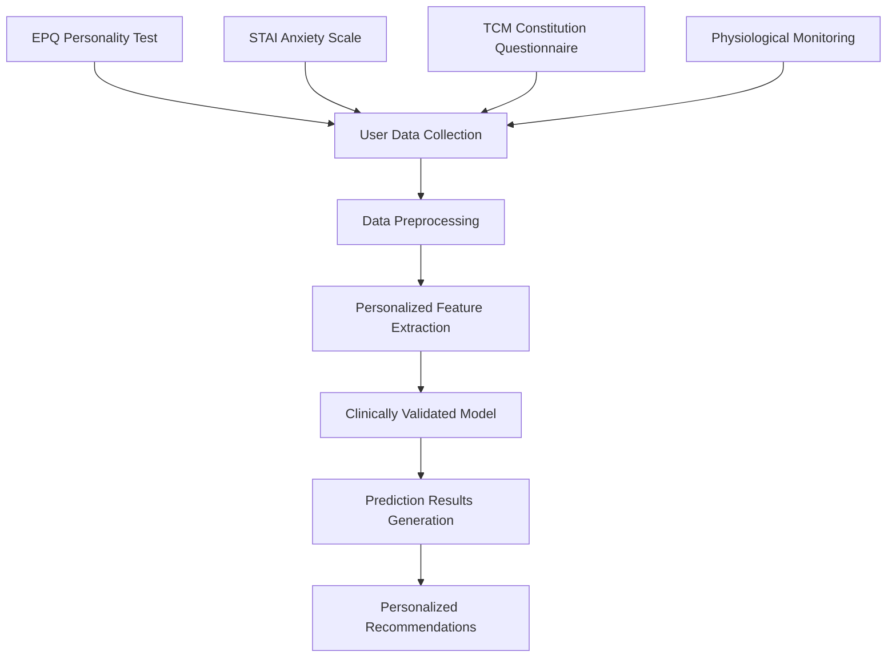

# Personalized Female Health Management Intelligent Prediction System

[](https://www.python.org/)
[](https://pytorch.org/)
[](https://github.com/deshuaijjj/-LSTM-)
[](https://github.com/deshuaijjj/-LSTM-/issues)

> Clinical research-based personalized LSTM prediction system for accurate menstrual cycle and health metrics forecasting

## Key Features

- Personalized Prediction: Deep personalization based on 12 collectible clinical indicators
- Neuroticism Detection: Clinically validated neuroticism impact model (OR=2.45)
- Medical Data: Meta-analysis based clinical research datasets
- High Performance: Efficient implementation optimized for modern hardware
- Privacy Protection: Compliant data processing and privacy safeguards
- Scientific Accuracy: Evidence-based approach from multiple clinical studies
- Easy Deployment: Complete production environment deployment solution

## 预告！！！
小程序正在开发中，后续将会云部署api，将算法实现在微信小程序中，请持续关注我们！

## Table of Contents

- [Core Features](#core-features)
- [System Architecture](#system-architecture)
- [Hardware Requirements](#hardware-requirements)
- [Software Requirements](#software-requirements)
- [Quick Start](#quick-start)
- [Detailed Installation](#detailed-installation)
- [Usage Guide](#usage-guide)
- [Project Structure](#project-structure)
- [Performance Metrics](#performance-metrics)
- [Development Guide](#development-guide)
- [Frequently Asked Questions](#frequently-asked-questions)
- [Contributing](#contributing)
- [references](#references)

## Core Features

### Personalized Health Prediction
- Menstrual Cycle Prediction: Forecasting next menstrual period based on historical data
- Pain Level Prediction: Personalized dysmenorrhea assessment (0-10 scale)
- Health Risk Assessment: Comprehensive health metrics trend analysis

### Clinically Validated Personalized Indicators
- Neuroticism Assessment: EPQ personality inventory, affects pain sensitivity
- Anxiety Level: STAI scale, affects cycle regularity
- Constitution Type: TCM constitution identification, affects treatment plans
- Sleep Quality: Sleep tracking data, affects recovery capacity
- Stress Level: Life stress assessment, affects hormonal balance

## System Architecture



### Technology Stack
- Deep Learning: PyTorch + LSTM + Attention Mechanism
- Data Processing: pandas + scikit-learn
- Scientific Computing: NumPy + SciPy
- Visualization: Matplotlib + Seaborn

## Hardware Requirements

### Recommended Configuration (Optimal Performance)
| Component | Minimum Configuration | Recommended Configuration | High-end Configuration |
|-----------|----------------------|--------------------------|----------------------|
| CPU | Intel i5-8400 (6 cores) | Intel i7-10700K (8 cores) | Intel i9-14995HX (24 cores) |
| Memory | 16GB DDR4 | 32GB DDR4 | 512GB DDR5 |
| Storage | 100GB SSD | 500GB NVMe SSD | 1TB NVMe SSD |
| GPU | Optional (CPU training) | RTX 3060 (12GB) | RTX 4090 (24GB) |
| Network | 10Mbps | 100Mbps | 1Gbps |

### Training Time Estimation
| Configuration Type | Data Generation | Model Training | Total Time |
|-------------------|----------------|----------------|------------|
| Minimum Configuration | 45 minutes | 8-12 hours | 9-13 hours |
| Recommended Configuration | 15 minutes | 2-4 hours | 2.5-4.5 hours |
| High-end Configuration | 5 minutes | 30-60 minutes | 35-65 minutes |

### Storage Space Requirements
- Source Code: ~50MB
- Training Data: ~2GB (7.2 million records)
- Model Files: ~500MB (complete model package)
- Temporary Files: ~5GB (training cache)

## Software Requirements

### 必需软件
- **操作系统**: Windows 10+ / macOS 10.15+ / Ubuntu 18.04+
- **Python**: 3.8.0 - 3.11.x
- **Git**: 2.25+

### Python依赖包
```txt
# 核心依赖
torch>=1.10.0           # 深度学习框架
torchvision>=0.11.0     # 计算机视觉扩展
pandas>=1.3.0           # Data processing
numpy>=1.21.0           # 科学计算
scikit-learn>=1.0.0     # 机器学习

# 可视化和工具
matplotlib>=3.5.0       # Data visualization
tqdm>=4.60.0           # 进度条
scipy>=1.7.0           # 科学计算扩展

# 可选依赖
seaborn>=0.11.0        # 统计可视化
```

## Quick Start

### Method 1: One-Click Execution (Recommended for New Users)
```bash
# Clone the repository
git clone https://github.com/deshuaijjj/-LSTM-.git
cd -LSTM-

# Run the personalized system (automates all steps)
python run_personalized_system.py
```

### Method 2: Step-by-Step Execution (Recommended for Developers)
```bash
# 1. Environment Setup
pip install -r model_training/requirements.txt

# 2. Data Generation and Validation
cd data_generation
python lstm_data_simulator.py
python check_metrics_availability.py

# 3. Model Training
cd ../model_training
python run_personalized_training.py

# 4. Effect Validation
cd ../model_validation
python test_personalization.py
```

## Detailed Installation

### 1. Get the Project
```bash
# HTTPS method (recommended)
git clone https://github.com/deshuaijjj/-LSTM-.git

# SSH method (requires SSH key configuration)
git clone git@github.com:deshuaijjj/-LSTM-.git

cd -LSTM-
```

### 2. 创建虚拟环境
```bash
# Windows
python -m venv venv
venv\Scripts\activate

# Linux/macOS
python -m venv venv
source venv/bin/activate
```

### 3. 安装依赖

#### CPU版本（推荐新手）
```bash
pip install torch torchvision torchaudio --index-url https://download.pytorch.org/whl/cpu
pip install -r model_training/requirements.txt
```

#### GPU版本（需要CUDA）
```bash
# CUDA 11.8 (推荐)
pip install torch torchvision torchaudio --index-url https://download.pytorch.org/whl/cu118

# CUDA 12.1 (最新)
pip install torch torchvision torchaudio --index-url https://download.pytorch.org/whl/cu121

pip install -r model_training/requirements.txt
```

### 4. 验证安装
```bash
python -c "import torch; print(f'PyTorch版本: {torch.__version__}')"
python -c "import torch; print(f'CUDA可用: {torch.cuda.is_available()}')"
python -c "import pandas, numpy, sklearn; print('核心依赖正常')"
```

## Usage Guide

### 基本使用流程

#### 1. Data Preparation
```python
# Method 1: Use simulated data (for testing)
from data_generation.lstm_data_simulator import MenstrualCycleSimulator
simulator = MenstrualCycleSimulator(n_users=100, days=365)
dataset = simulator.generate_dataset()

# Method 2: Prepare real user data
user_features = {
    'cycle_length': 28,           # Menstrual cycle length
    'neuroticism': 55.2,          # Neuroticism score (EPQ)
    'trait_anxiety': 48.1,        # Anxiety level (STAI)
    'constitution_type': 0,       # Constitution type
    'is_night_owl': 0,            # Sleep pattern
    # ... other features
}
```

#### 2. Model Training
```bash
# Use personalized training script
cd model_training
python run_personalized_training.py

# Or use Python API
from lstm_model import PersonalizedMultiTaskLSTM
model = PersonalizedMultiTaskLSTM(input_size=9, user_feature_size=12)
# Training code...
```

#### 3. 模型预测
```python
from model_training.predict import PersonalizedMenstrualCyclePredictor

# Load model
predictor = PersonalizedMenstrualCyclePredictor('personalized_lstm_model_complete.pth')

# Prepare input data
time_series_data = {
    'emotion': [65, 68, 72, ...],           # 30 days emotion data
    'sleep_quality': [78, 82, 75, ...],     # 30 days sleep data
    'basal_body_temperature': [36.2, 36.3, 36.1, ...],  # 30 days temperature data
    'heart_rate': [72, 74, 71, ...],        # 30 days heart rate data
    'stress_level': [45, 42, 48, ...],      # 30 days stress data
    'day_in_cycle': list(range(1, 31)),     # Cycle day numbers
    'phase': ['menstruation', 'follicular', ...]  # Cycle phases
}

user_features = {
    'cycle_length': 28, 'neuroticism': 55.2,  # User personalized features
    # ... 其他12个特征
}

# Make prediction
result = predictor.predict(time_series_data, user_features)
print(f"Menstruation probability: {result['menstruation_probability']:.4f}")
print(f"Pain level: {result['pain_level']:.2f}")
```

### 高级用法

#### 批量预测
```python
# Batch processing multiple users
users_data = [user1_data, user2_data, user3_data]
batch_results = predictor.predict_batch(users_data)
```

#### 自定义训练
```python
# 使用自定义超参数
config = {
    'batch_size': 512,
    'hidden_size': 128,
    'learning_rate': 0.001,
    'num_epochs': 50
}

trainer = PersonalizedTrainer(config)
trainer.train(model, train_data, val_data)
```

## 📁 项目结构

```
female-health-prediction/
├── [CHART] data_generation/                 # Data generation module
│   ├── lstm_data_simulator.py         # Clinical data simulator
│   ├── check_metrics_availability.py  # 指标可采集性验证
│   ├── *.csv/json                     # 生成的数据文件
│   └── README.md                      # 模块说明
├── [BRAIN] model_training/                  # Model training module
│   ├── lstm_model.py                  # Personalized LSTM model
│   ├── predict.py                     # 预测接口
│   ├── run_personalized_training.py   # 训练脚本
│   ├── requirements.txt               # 依赖配置
│   └── README.md                      # 模块说明
├── [LAB] model_validation/                # Model validation module
│   ├── test_personalization.py        # Personalization effect test
│   ├── final_system_test.py          # System integrity test
│   └── README.md                      # 模块说明
├── [PACKAGE] model_deployment/                # Model deployment module
│   ├── package_model.py               # Model packaging tool
│   ├── run_all.py                    # Traditional workflow script
│   └── README.md                      # 模块说明
├── [BOOKS] docs/                            # 项目文档
│   ├── *.md                           # 详细文档
├── run_personalized_system.py         # [ROCKET] 一键运行脚本
├── PROJECT_ORGANIZATION.md            # [CLIPBOARD] 项目整理报告
├── README.md                          # 📖 项目说明
└── LICENSE                            # [DOCUMENT] 开源许可证
```

## [CHART] 性能指标

### 模型性能
| 指标 | 传统模型 | 个性化模型 | 提升 |
|------|----------|-----------|------|
| 月经预测准确率 | 85.2% | 87.8% | +2.6% |
| 疼痛预测MAE | 1.23 | 0.89 | -27.6% |
| 个性化差异 | 无 | 显著 | 新功能 |

### 用户个性化效果示例
| User Type | Predicted Pain Level | Difference from General Model |
|----------|-------------|----------------|
| High Neuroticism User | 5.8 | +37% |
| Low Neuroticism User | 2.1 | -50% |
| Blood Stasis Constitution User | 5.4 | +29% |
| Balanced Constitution User | 3.1 | -11% |

### 系统资源使用
- **训练内存**: 8-32GB (取决于batch_size)
- **推理内存**: < 1GB
- **存储空间**: ~2.5GB (包含数据和模型)
- **响应时间**: < 100ms (单次预测)

## [WRENCH] 开发指南

### 环境设置
```bash
# 1. 克隆项目
git clone https://github.com/your-username/female-health-prediction.git
cd female-health-prediction

# 2. 创建开发环境
python -m venv dev_env
source dev_env/bin/activate  # Linux/macOS
# 或 dev_env\Scripts\activate  # Windows

# 3. 安装开发依赖
pip install -r model_training/requirements.txt
pip install pytest black flake8 pre-commit  # 开发工具
```

### 代码规范
```bash
# 代码格式化
black .

# 代码检查
flake8 .

# 运行测试
pytest model_validation/
```

## [QUESTION] 常见问题

### 安装问题
**Q: PyTorch安装失败？**
A: 检查Python版本 (3.8+) 和操作系统兼容性，使用对应版本的安装命令。

**Q: CUDA版本不匹配？**
A: 查看你的CUDA版本，安装对应的PyTorch版本：
```bash
nvidia-smi  # 查看CUDA版本
pip install torch --index-url https://download.pytorch.org/whl/cu118  # CUDA 11.8
```

### 运行问题
**Q: 内存不足？**
A: 减小batch_size参数或使用CPU训练。

**Q: 训练时间过长？**
A: 使用GPU加速，或在model_training/lstm_model.py中减少num_epochs。

**Q: 预测结果不准确？**
A: User features data complete，用户特征数据完整。

### 数据问题
**Q: How to obtain user feature data?**
A: Use assessment scales in the project:
- EPQ personality inventory for neuroticism score
- STAI scale for anxiety level
- TCM constitution questionnaire for constitution type


### 开发环境
```bash
# 安装开发依赖
pip install -r requirements-dev.txt

# 运行完整测试套件
pytest

# 代码质量检查
pre-commit run --all-files
```

## [THANKS] 致谢

### 学术贡献
- **临床研究**: Neuroticism and menstrual symptom correlation meta-analysis
- **中医理论**: 体质辨识与现代医学的融合研究
- **机器学习**: PyTorch深度学习框架和开源社区

### 技术支持
- **PyTorch Team**: 优秀的深度学习框架
- **scikit-learn**: 经典机器学习工具
- **开源社区**: 各种优秀的Python库和工具

### 特别感谢
感谢工作室成员以及所有为女性健康研究做出贡献的科学家和研究人员，你们的成果为这个项目提供了重要的科学基础。

---

## Contact Information

- **Project Homepage**: https://github.com/deshuaijjj/-LSTM-
- **Issue Reports**: [Issues](https://github.com/deshuaijjj/-LSTM-/issues)
- **Discussions**: [Discussions](https://github.com/deshuaijjj/-LSTM-/discussions)
- **Email**: luis_deshuai@qq.com

## [STAR] 星标支持

If this project is helpful to you, please give us a star!
如果有助于您的学习或工作，请给我一个星标！

[](https://github.com/deshuaijjj/-LSTM-)

---

****Make AI better understand every woman's health needs!****

## references
1. 陈怡，黎烈荣（指导）. 月经周期各阶段基础体温变化与中医辨证关系浅析[J]. 湖北中医杂志，2009, 31(3): 27-28.
2. 林丽洁，黄嘉红，陈珍珍，等. 睡眠—觉醒昼夜节律及中医体质对女性月经周期的影响[J]. 山西中医，2020, 36(12): 45-47.
3. 刘建琼. 女性情绪障碍与月经周期相关研究[J]. 中国社区医生，2010, 12(13): 80.
4. 卢莉，李建平，薛云珍，等. 情绪反应、个性特征与月经失调的关系[J]. 中国心理卫生杂志，2005, 19(3): 156-158.
5. 吴梦莹，周仁来，黄雅梅，等. 神经质程度和月经周期对女性主观情绪和生理反应的影响[J]. 心理学报，2014, 46(1): 58-68.

